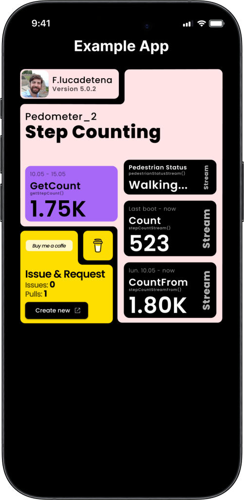

# Pedometer Pro

[English](README.md)

*基于 Pedometer 与 Pedometer_plus（见文末致谢）*

在 Android 和 iOS 上可以获取：
- 指定 `from:to` 时间范围内的步数
- 自上次开机以来的步数
- 实时步数（Stream）
- 实时步行状态：Walking / Stopped（Stream）
- 自某日起的实时步数（Stream，仅 iOS；Android 替代方案见下文）

> Android 与 iOS 均支持。
> 使用 Sensors API（Android 与 iOS），以及 Recording API（Android，在有 Google Play 服务时）。

包地址：[https://pub.dev/packages/pedometer_pro](https://pub.dev/packages/pedometer_pro)

仓库：[https://github.com/whevether/pedometer_2](https://github.com/whevether/pedometer_2)



## Android 数据源

| 能力 | 有 Google Play 服务 | 无 GMS（小米 / OPPO / vivo 等） |
| --- | --- | --- |
| 实时 `stepCountStream` / `pedestrianStatusStream` | 硬件 `TYPE_STEP_COUNTER` / `TYPE_STEP_DETECTOR` | 同一套传感器，**可用** |
| `getStepCount(from, to)` 历史查询 | Recording API（约 10 天） | 回退到 `TYPE_STEP_COUNTER`（**仅上次开机以来的累计步数**，无法按自然日拆分） |

小米 / OPPO / vivo 的省电策略可能杀掉后台监听。实时流建议在前台使用；若需要更稳定的统计，请引导用户关闭该应用的电池优化。

运行示例：

```sh
cd example && flutter run
```

示例应用的 Android release 签名使用仓库内测试证书（`example/jks/`），说明见 [example/jks/README.md](example/jks/README.md)。**不可用于正式发布。**

## 配置

### 权限

Android 和 iOS 都需要申请活动识别 / 运动权限。
推荐使用 [permission_handler](https://pub.dev/packages/permission_handler)，也可以用其他权限库。

<details open>
  <summary><b>iOS</b></summary>

本插件同时支持 **CocoaPods 与 Swift Package Manager**。示例应用使用 Swift Package Manager。

- CocoaPods：`ios/pedometer_pro.podspec`
- SwiftPM：`ios/pedometer_pro/Package.swift` 与 `ios/pedometer_pro/Sources/`

1. 在 `ios/Runner/Info.plist` 中加入：

   ```xml
   <key>NSMotionUsageDescription</key>
   <string>This application tracks your steps</string>
   ```

   使用 Swift Package Manager 以及较新的 `permission_handler` 时，有这条 Info.plist 即可启用传感器权限。

2. 若宿主应用仍使用 **CocoaPods**，再在 `ios/Podfile` 中加入：

   ```rb
    post_install do |installer|
        installer.pods_project.targets.each do |target|
            flutter_additional_ios_build_settings(target)

            ## ADD THIS SECTION
            target.build_configurations.each do |config|
                config.build_settings['GCC_PREPROCESSOR_DEFINITIONS'] ||= [
                '$(inherited)',
                ## dart: PermissionGroup.sensors
                'PERMISSION_SENSORS=1',
                ]
            end
            ## END OF WHAT YOU NEED TO ADD
        end
    end
   ```

   若 `Podfile` 里已经有 `target.build_configurations.each do |config|` 循环，只需把 `config.build_settings` 那段放进现有循环。
   若已经在用 *permission_handler*，把 `PERMISSION_SENSORS` 设为 `1` 而不是 `0`。

</details>

<details open>
  <summary><b>Android</b></summary>

- 不必在应用 Manifest 里手写 `ACTIVITY_RECOGNITION`，插件会在构建时合并进去。
- 需要 **Android 10（minSdk 29）**。在 `android/app/build.gradle`（或 `.kts`）中设置。
- 确保已启用 AndroidX（较新的 Flutter 工程默认已开启）。

</details>

## 用法

1. <details open>
   <summary><b>申请权限</b></summary>

    - 使用 *permission_handler* 可同时覆盖两个平台。
    - 可用 `openAppSettings()` 打开系统设置，方便用户在系统不再弹窗时手动开启权限。
        #### 行为
    - 第一次会弹出系统对话框；之后返回上次结果或当前系统设置。
    - 若被拒绝，请用 SnackBar / 对话框提示用户去设置里打开。
        #### 示例：
        ```dart
        import 'package:permission_handler/permission_handler.dart';

        PermissionStatus perm =
        Platform.isAndroid ? await Permission.activityRecognition.request() : await Permission.sensors.request();
        print('perm: $perm');

        if (perm.isDenied || perm.isPermanentlyDenied || perm.isRestricted) {
            ScaffoldMessenger.of(context).showSnackBar(
                SnackBar(
                    content: Text(
                        'You need to approve the permissions to use the pedometer',
                        style: TextStyle(
                        color: Theme.of(context).colorScheme.onError,
                        fontWeight: FontWeight.bold,
                        ),
                    ),
                    backgroundColor: Theme.of(context).colorScheme.errorContainer,
                    action: SnackBarAction(
                        label: 'Settings',
                        textColor: Theme.of(context).colorScheme.onError,
                        onPressed: () => openAppSettings(),
                    ),
                ),
            );
        } else {
            // 再调用读取步数的 API
        }
        ```
    </details>

2. <details open>
   <summary><b>查询步数</b></summary>

    - 按时间范围（`from` / `to`）查询总步数。
    - 未传 `from` 或 `to` 时，默认取平台最大窗口：iOS 7 天，Android（有 GMS）10 天。
    - 查询区间超过窗口时，返回值只覆盖该窗口内的数据。
        #### 行为
    - 安装并授权后第一次查询可能为 `0`，因为系统从授权后才开始记录。
    - 卸载重装后第一次同样可能为 `0`。
    - 有 GMS 时数值接近 Google Fit；无 GMS 时 Android 只能返回 **上次开机以来** 的步数。
        #### 示例：
        ```dart
        import 'package:pedometer_pro/pedometer_pro.dart';

        DateTime now = DateTime.now();
        DateTime from = now.subtract(Duration(days: now.weekday - 1));
        DateTime to = now.add(Duration(days: DateTime.daysPerWeek - now.weekday));

        int steps = await Pedometer().getStepCount(from: from, to: to);
        print('steps: $steps');
        ```
    </details>

3. <details open>
    <summary><b>实时步数（Stream）与开机以来步数</b></summary>

    - 首次事件是上次开机以来的步数，之后随走动持续推送。
    - 若值为 `0`，可能要等用户迈出一步才会发事件。
        #### 行为
    - 关机重启或手动改系统日期后，该值会回到 `0`。
        #### 示例：
        ```dart
        StreamSubscription? _subStepCount;

        @override
        void initState() {
            super.initState();
            _listenToSteps();
        }

        @override
        void dispose() {
            _subStepCount?.cancel();
            super.dispose();
        }

        _listenToSteps() {
            _subStepCount = Pedometer().stepCountStream().listen((steps) => print('Steps: $steps'));
        }
        ```
    </details>

4. <details open>
    <summary><b>实时步行状态：Walking / Stopped（Stream）</b></summary>

    - 返回 `stopped` 或 `walking`；出错时为 `unknown`。
        #### 行为
    - 初始化后可能要等状态变化才发事件。开始时可先当作 `stopped`。
        #### 示例：
        ```dart
        StreamSubscription? _subPedestrianStatus;

        @override
        void initState() {
            super.initState();
            _listenToStatus();
        }

        @override
        void dispose() {
            _subPedestrianStatus?.cancel();
            super.dispose();
        }

        _listenToStatus() {
            _subPedestrianStatus = Pedometer().pedestrianStatusStream().listen((status) => print('Status: $status'));
        }
        ```
    </details>

5. <details open>
    <summary><b>[iOS] 自某日起的实时步数（Stream）</b></summary>

    - **Android 替代：** 组合使用 `getStepCount` 与 `stepCountStream`。见 example 应用。
    - 返回从 `from` 到 `now()` 的步数，并持续推送增量。
        #### 行为
    - 与 `stepCountStream` 类似：第一次可能为 `0`，直到用户开始走路。
    - iOS 最多保存 7 天。
        #### 示例：
        ```dart
        StreamSubscription? _subStepFrom;

        @override
        void initState() {
            super.initState();
            _listenToSteps();
        }

        @override
        void dispose() {
            _subStepFrom?.cancel();
            super.dispose();
        }

        _listenToSteps() {
            DateTime now = DateTime.now();
            DateTime from = now.subtract(Duration(days: now.weekday - 1));
            _subStepFrom = Pedometer().stepCountStreamFrom(from: from).listen((steps) => print('Steps: $steps'));
        }
        ```
    </details>

## 注意事项

部分机型可能没有对应 API，或表现不一致：

- 部分三星机型不支持 Sensors API。
- 较旧的 iPhone 不支持步行状态。
- 厂商传感器与系统策略不同，步数可能有差异（主要是 Android）。
- 没有 Google Play 服务时，Android 的 `getStepCount` **无法还原开机之前** 的历史步数。

若计步传感器不可用，会抛出错误，应用需要自行处理。

## 更新日志

见 [CHANGELOG.md](CHANGELOG.md) / [CHANGELOG_zh.md](CHANGELOG_zh.md)。

## 致谢

本包最初 fork 自：

- [Pedometer_plus](https://pub.dev/packages/pedometer_plus) by [akaboshinit.dev](https://pub.dev/publishers/akaboshinit.dev/packages)

其上游与灵感来源：

- [Pedometer](https://pub.dev/packages/pedometer) by [cachet.dk](https://pub.dev/publishers/cachet.dk/packages)
- [Simple_pedometer](https://pub.dev/packages/simple_pedometer) by [bookm.me](https://pub.dev/publishers/bookm.me/packages)

示例界面灵感来自 [Purrweb Agency - Dribbble](https://dribbble.com/shots/22762014-Step-Counter-Mobile-iOS-App)。

## 包状态

| Pub 版本 | 分数 | 热度 |
| --- | --- | --- |
| [](https://pub.dev/packages/pedometer_pro) | [](https://pub.dev/packages/pedometer_pro/score) | [](https://pub.dev/packages/pedometer_pro/score) |
